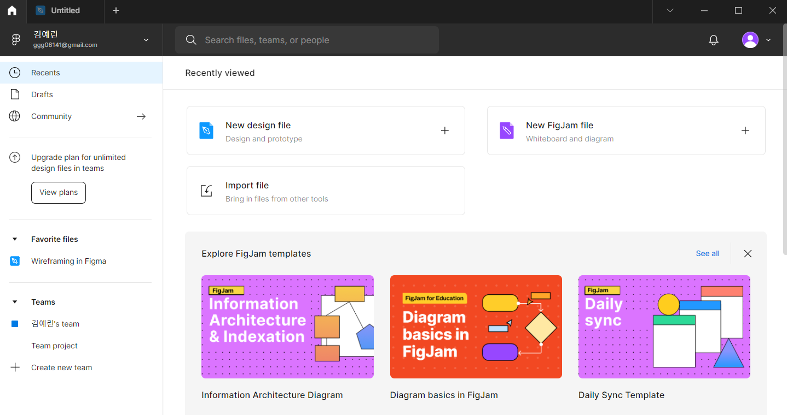

### 📱 와이어프레임 & 프로토타입

 

#### 와이어프레임(wireframe)
---

와이어프레임은 선(wire)으로 틀(frame)을 잡는다는 뜻으로, 제품 기획 단계에서 페이지를 어떻게 구성할 것인지 구조를 잡기위한 목적으로 만든다.

 

#### 프로토타입(prototype)
---

프로토타입은 실제 제품과 거의 흡사하게 구현한 것으로, 페이지 이동과 상호 작용이 가능합니다. 본격적으로 개발에 들어가기 전 단계에 작성하며, UI의 상호 작용을 시뮬레이션하는 것이 목적이다.  

 

#### 차이점

와이어프레임이나 프로토타입을 표현할 때 품질 수준을 전문용어로 **피델리티(fidelity)** 라고 표현한다.

||와이어프레임|프로토타입|
|------|---|---|
|작성시기|기획 단계|개발 전 단계|
|작성목적|화면 구조 설계|UI 상호작용 시뮬레이션|
|특징|정적|동적|
|피델리티|Low ~ Middle (High는 거의 작성하지 않음)|Middle ~ High (Low는 테스트에 적합하지 않음)|

 
 

### 🎨 Figma

2016년 9월에 출시된 UI 디자인&프로토타이밍 툴  

 

#### Figma 특징
---

**1. 실시간 협업 기능**

Figma는 한 화면에서 여러 명의 사람이 동시에 작업할 수 있는 기능을 제공한다. 이러한 기능은 비대면 협업의 중요성이 높아지면서 Figma를 더욱 매력적인 툴로 만들었다.

**2. 다양한 환경 지원**

Figma는 웹 브라우저 기반 프로그램이기 때문에 브라우저만 사용할 수 있다면 어떤 환경에서든 사용이 가능하다. Mac, Window, Linux 등 다양한 OS 환경은 기기도 가리지 않는다. 필요에 따라 프로그램을 직접 설치해서 사용할 수도 있다.

**3. 자동 저장 및 버전 관리**

Figma는 자동 저장 기능을 제공한다. 그리고 누가 언제 무엇을 변경했는지 확인할 수 있는 히스토리 기능도 있어 버전 관리에도 유리하다.

**4. 다양한 무료 폰트 지원**

Figma는 구글 폰트를 활용할 수 있어 폰트를 별도로 설치할 필요가 없고, 폰트가 없어서 화면이 깨지는 현상도 발생하지 않는다. 또한, 구글 폰트 이외에도 사용자 PC에 저장된 로컬 폰트를 불러와서 사용할 수도 있다.

**5. 오토 레이아웃 기능**

Figma의 오토 레이아웃 기능을 사용하면 요소들 사이의 간격과 정렬에 규칙을 부여할 수 있고, 이 요소들의 크기가 변하더라도 부여한 규칙에 맞게 간격과 정렬을 유지할 수 있다.

**6. 프로토타이핑**

Figma에서 제공하는 프로토타입 기능을 활용하면 간단한 Lo-Fi 수준의 프로토타입부터 실제 화면과 거의 흡사한 Hi-Fi 수준의 프로토타입까지 제작할 수 있다.

 

#### 자주 사용하는 기능 & 단축키 모음
---

윈도우 키

       
 

||Mac|Windows|
|------|---|---|
||Command|windows 키|
||option|ALT|

 

* 여러 요소 동시에 선택하기 : `Shift` 누른 상태로 클릭
* 프레임으로 묶기 : `Command` + `Option` + `G`
* 그룹, 프레임 해제하기 : `Command` + `Shift` + `G`

Figma는 이 외에도 다양한 단축키를 제공한다. Figma 화면에서 `Control` + `Shift` + `?` 를 누르면 사용 가능한 모든 단축키를 확인할 수 있다.

`Command` 키가 아니라 `Control` 키라는 것을 잊지말자!