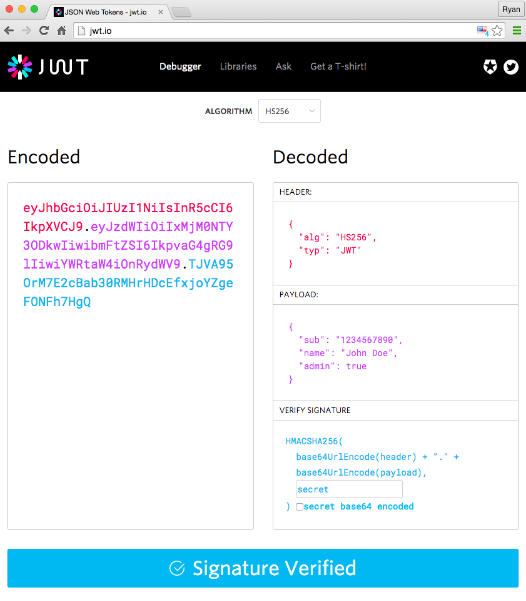

지난 시간에 Cookie, Session에 대해 알아보았습니다. 오늘은 Token에 대해 알아보도록 하겠습니다.

## Token
---

> 토큰은 "나는 돈을 지불했고, 이 시설 또는 서비스를 사용할 수 있어!"라는 메시지를 담고 있는 입장 티켓이라고 이해할 수 있습니다.

이러한 개념에서 착안하여 클라이언트에서 인증 정보를 보관하는 방법으로 토큰기반 인증이 고안되었습니다.

* 그러면 토큰을 클라이언트에 저장하는 것이 위험하지 않나요?

    토큰은 유저 정보를 암호화했기 때문에, 클라이언트에 담을 수 있습니다.

### JWT

JWT는 엑세스 토큰, 리프레시 토큰을 이용해 인증 구현을 합니다. 권한을 부여 받는 데엔 엑세스 토큰만 가지고 있으면 되지만, 유효기간이 만료된다면 리프레시 토큰을 사용하여 새로운 토큰을 발급받아야 합니다. 이때 유저는 다시 로그인할 필요가 없습니다.

 

JWT 구조에 대해 알아보겠습니다.

#### 1. Header
---

어떤 종류의 토큰인지, 어떤 알고리즘으로 암호화 할 지 적혀있습니다.

#### 2. Payload
---

유저의 정보, 어떤 정보에 접근 가능한지에 대한 권한을 담을 수 있고, 기타 필요한 정보가 적혀있습니다.

#### 3. Signiture
---

Header, Payload를 base64인코딩한 값과 salt값의 조합으로 암호화된 값이 적혀있습니다. 

 

**누군가 권한을 속이기 위해 Payload를 변조하여 base64로 인코딩하더라도 원본 Payload로 암호화한 시그니처 값과 다르기 때문에 서버가 해당 토큰이 변조되었음을 확인할 수 있습니다.**

 

## OAuth
---
 > 인증을 중개해주는 메커니즘

 이미 사용자 정보를 가지고 있는 웹 서비스에서 사용자의 인증을 대신해주고, 접근 권한에 대한 토큰을 발급한 후, 이를 이용해 내 서버에서 인증이 가능해집니다.

또한, ID와 Password만 기억해 놓고, 해당 서비스들을 통해서 외부 서비스로 소셜 로그인을 할 수 있습니다.