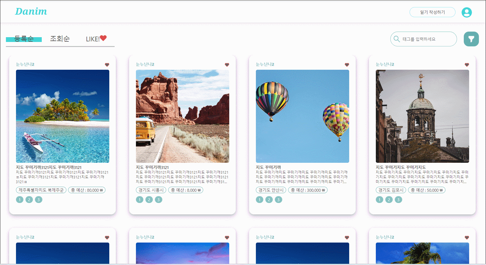

2가지 방법으로 모달 창을 구현하면서 새롭게 알게 된 점을 중점으로 작성하려고 한다.

<br>

## 1. useRef

---

```js
const modalRef = useRef();
const insideClickRef = useRef();

return (
  <Modal>
    <div ref={modalRef} className="modal-inside">
      <HeaderModal />
    </div>
  </Modal>
);
```

<br>

먼저 useRef를 사용한 이유는 특정 영역을 포커싱하여 사용할 수 있어서 편리했다. 모달 영역 밖 클릭했을 때 닫히게 하려고 했다.

`modalRef.current.style.display = "none";`

모달창 영역 밖에 해당하는 부분을 useRef를 통해 선택한 후, 해당 Element가 클릭 되었을 때만 모달창이 닫히도록 이벤트를 주면 된다.

<br>

## 2. onClick={openModal}

---

```js
const [isOpen, setIsOpen] = useState(false);
const openModal = () => {
  setIsOpen2(!isOpen);
};

return (
  <Container>
    <Inside>
      {isOpen2 === true ? (
        <ModalBackdrop onClick={openModal}>
          <ModalView onClick={(e) => e.stopPropagation()}>
            <CloseModal />
          </ModalView>
        </ModalBackdrop>
      ) : null}
    </Inside>
  </Container>
);
```

<br>

`useState`를 이용한 방법이다.

`ModalBackdrop`은 배경을 클릭했을 때에도 모달 창이 꺼질 수 있게 클릭이벤트를 넣어주었다.
`stopPropagation()`은 박스 안을 클릭해도 모달창 닫히지 않게 이벤트 중지하게 했다.

### event.stopPropagation의 역할?

즉, `ModalView`를 클릭하게 되면 `ModalBackdrop`까지 이벤트가 전달되는 것을 막아 `ModalBackdrop`의 클릭 이벤트 실행을 막아주는 역할을 한다.

<br>

## 시행착오 😲

---

### 헤더 Multiple Modal



헤더에서 유저 이미지를 클릭하면 첫번째 모달이 열리고, 로그아웃 버튼을 누르면 두번째 모달이 열리도록 모달 창을 구현했었다.

useRef를 사용한 이유는 모달 영역 밖을 클릭했을 때 모달을 닫히게 하기 위해 useRef를 사용했었다. 또한, useRef를 사용해 특정 영역을 포커싱하여 사용할 수 있어서 편리했었다.

로그아웃 버튼을 클릭했을 때 똑같은 방법으로 useRef를 사용하였지만, 모달 외부를 클릭했을 때 모달이 닫히지 않는 문제가 있었다. 이후에 검색을 통해, useRef를 사용해 직접 dom에 접근을 지양하는 것이 좋다는 것을 알게 되었고, 또 다른 방법인 useState를 이용해 해결할 수 있었다.

추후에 useRef를 사용한 모달 창을 useState를 사용해서 모달 창을 개선해야 할 것 같다.
